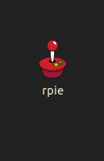
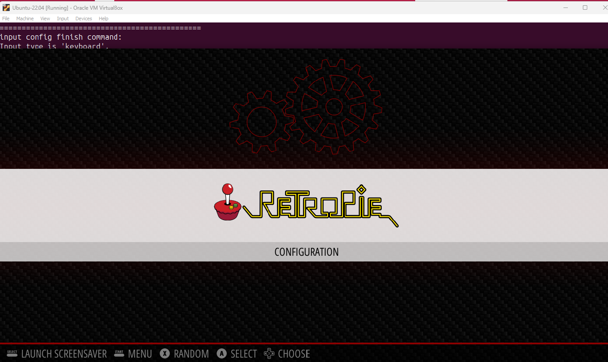
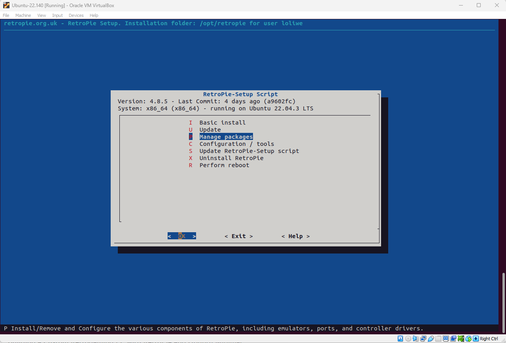
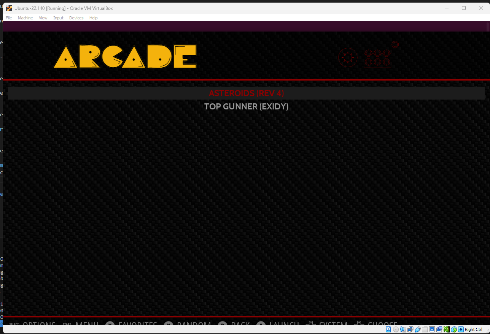

# RetroPie in your local PC
Table of content

- [About RetroPie](#About)
- [Prerequisites](#Prerequisites)
- [Installation](#Installation)
- [Activate your RetroPie/an emulator](#Activate)
- [Load games](#Load)

## About RetroPie

Raspbery Pi (with RetroPie pre-installed) is an operating system, and one of its uses is for playing games. The portable standalone Raspbery Pi device requires a screen, keyboard, mouse, and power cable. While the games are saved on a Micro SD card and inserted in the relevant slot in the Raspbery Pi. 

For your learning, if you do not have access to an arcade machine, which in this company we test our games on, we will guide you to install RetroPie in your Ubuntu virtual machine.

## Prerequisites

You will need to:
- have a computer (or laptop)
- set up a virtual machine and load the latest version of Ubuntu, see https://www.oracle.com/virtualization/technologies/vm/downloads/virtualbox-downloads.html and https://ubuntu.com/download.

## Installation

Open Ubuntu terminal input
```cpp
sudo apt install git dialog unzip xmlstarlet
```

Press 'enter' and input in the terminal
```cpp
git clone --depth=1 https://github.com/RetroPie/RetroPie-Setup.git
```

Press 'enter' and input in the terminal
```cpp
cd RetroPie-Setup
```

Press 'enter' and input in the terminal
```cpp
sudo ./retropie_setup.sh
```

Press 'enter' and on the screen that will appear, select 'Basic install'. When installation is done, select `<OK>` and Press 'enter'. Now, you can 'close/exit' this screen.

## Activate your RetroPie/select an emulator

Since your VM RetroPie is different from the unit you would have bought with its OS functionalities already installed, you will need to activate your copied one.

Open Ubuntu terminal input
```cpp
sudo ./retropie_setup.sh
```
or search for RetrPie under your Ubuntu applications and double-click RetroPie icon to open



Select RetroPie and press 'A' in your keyboard (assuming you have configured your input device)



Move down to 'RetroPie Setup' and press 'A' in your keyboard

On the next screen type your `user-password` and press 'enter'

Move down to 'Manage packages' and press 'enter'



Move down to 'Manage experimental packages' and press 'enter'

Below the first dotted line you can select an of the emulators listed (or import yours). I have selected `mame`. NOTE: this step will take more than 50 minutes to coomplete installation.

When installing is done, you can exit and restart your RetroPie.

## Load games

For instance, you could download games (i.e., ROMS) online or after writing your python, java, c++ or c# game you will need to compile/package it.

Then locate the folder for arcade games and save the zipped folders of your game/s
`~/RetroPie/roms/arcade`

Then, you can restart your RetroPie and there will be an icon for a category with games (e.g., arcade) on it in the center of your screen along side the RetroPie's one.

Press 'A' to load the area with your games and you will need select the the emulator that you loaded on the previous step to get going with your game.


