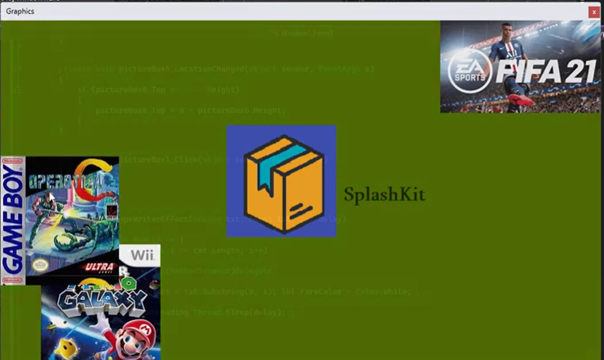

# Emulation graphics

As a player, I wish to have a SplashKit graphic screen as part of the Emulation Station or for one of our games. So if we assume that our code Main method is the following, it will need to call the `Form1` class that has our graphics.

```cpp
using System;
using System.Collections.Generic;
using System.Linq;
using System.Threading.Tasks;
using System.Windows.Forms;

namespace Window1
{
    internal static class Program
    {
        /// <summary>
        /// The main entry point for the application.
        /// </summary>
        [STAThread]
        static void Main()
        {
            Application.EnableVisualStyles();
            Application.SetCompatibleTextRenderingDefault(false);
            Application.Run(new Form1());
        }
    }
}
```

The next code is for graphics that will be displayed when our game has been selected.

```cpp
using System;
using System.Collections.Generic;
using System.ComponentModel;
using System.Data;
using System.Drawing;
using System.Linq;
using System.Text;
using System.Threading.Tasks;
using System.Windows.Forms;

namespace Window1
{
    public partial class Form1 : Form
    {
        int speed = 10;
        public Form1()
        {
            InitializeComponent();
        }

        int r = 192, g=0, b=0;
        private void Form1_Load(object sender, EventArgs e)
        {
            moveTimer.Interval = 20;
            moveTimer.Start();
            timer1.Start();

        }

        private async void pictureBox2_Click(object sender, EventArgs e)
        {
            pictureBox2.BackColor = Color.FromArgb(r, g, b);

            if (r > 0 && b == 0)
            {
                r--;
                g++;
            }
            if (g > 0 && r == 0)
            {
                g--;
                b++;
            }
            if (b > 0 && g == 0)
            {
                b--;
                r++;
            }

            if (pictureBox2.Right < this.Width/2)
            { 
                pictureBox1.Visible = true;
                pictureBox2.Visible = false;
                moveTimer.Stop();
                label1.Visible = true;

                label1.Enabled = false;
                await TypeWriterEffect("SplashKit", label1, 200);
                label1.Enabled = true;

                pictureBox3.Visible = true;
                pictureBox4.Visible = true;
                pictureBox5.Visible = true;
                pictureBox6.Visible = true;
            }
        }

        private void MoveTimerEvent(object sender, EventArgs e)
        {
            pictureBox2.Left -= 2;
            pictureBox2.Top += 1;
        }

        private void label1_Click(object sender, EventArgs e)
        {
           
        }

        private void Timer1_tick(object sender, EventArgs e)
        {
            this.BackColor = Color.FromArgb(r, g, b);

            if (r > 0 && b == 0)
            {
                r--;
                g++;
            }
            if (g > 0 && r == 0)
            {
                g--;
                b++;
            }
            if (b > 0 && g == 0)
            {
                b--;
                r++;
            }

            pictureBox3.Left += 1;
            pictureBox4.Top -= 1;
            pictureBox5.Left -= 1;
            pictureBox6.Top += 1;
        }

        private void pictureBox3_LocationChanged(object sender, EventArgs e)
        {
            if (pictureBox3.Left >= this.Width)
            {
                pictureBox3.Left = 0 - pictureBox3.Width;
            }
        }

        private void pictureBox5_Click(object sender, EventArgs e)
        {
            
        }

        private void pictureBox5_LocationChanged(object sender, EventArgs e)
        {
            if (pictureBox5.Right <= 0)
            {
                pictureBox5.Left = this.Width + pictureBox5.Left;
            }
        }

        private void pictureBox4_LocationChanged(object sender, EventArgs e)
        {
            if (pictureBox4.Bottom <= 0)
            {
                pictureBox4.Top = this.Height + pictureBox4.Top;
            }
        }

        private void pictureBox6_LocationChanged(object sender, EventArgs e)
        {
            if (pictureBox6.Top >= this.Height)
            {
                pictureBox6.Top = 0 - pictureBox6.Height;
            }
        }

        private void pictureBox1_Click(object sender, EventArgs e)
        {
            
        }

        public Task TypeWriterEffect(string txt, Label lbl, int delay)
        {
            return Task.Run(() => {
                for (int i = 0; i <= txt.Length; i++)
                {
                    lbl.Invoke((MethodInvoker)delegate
                    {
                        lbl.Text = txt.Substring(0, i); lbl.ForeColor = Color.White; ;
                    });
                    System.Threading.Thread.Sleep(delay); ;
                }
            });

        }
    }
}
```

A screenshot of our graphics is below.


